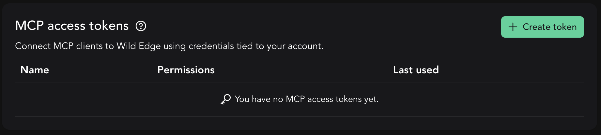
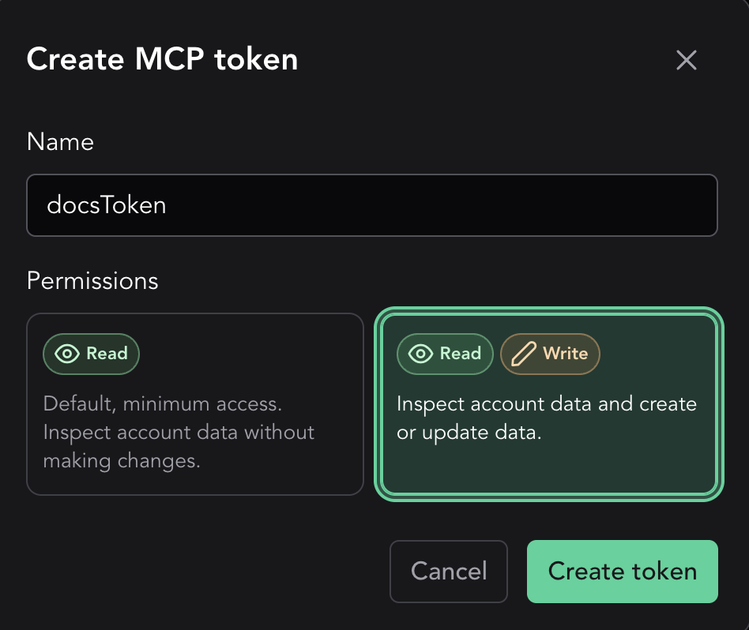
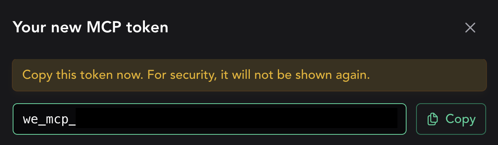
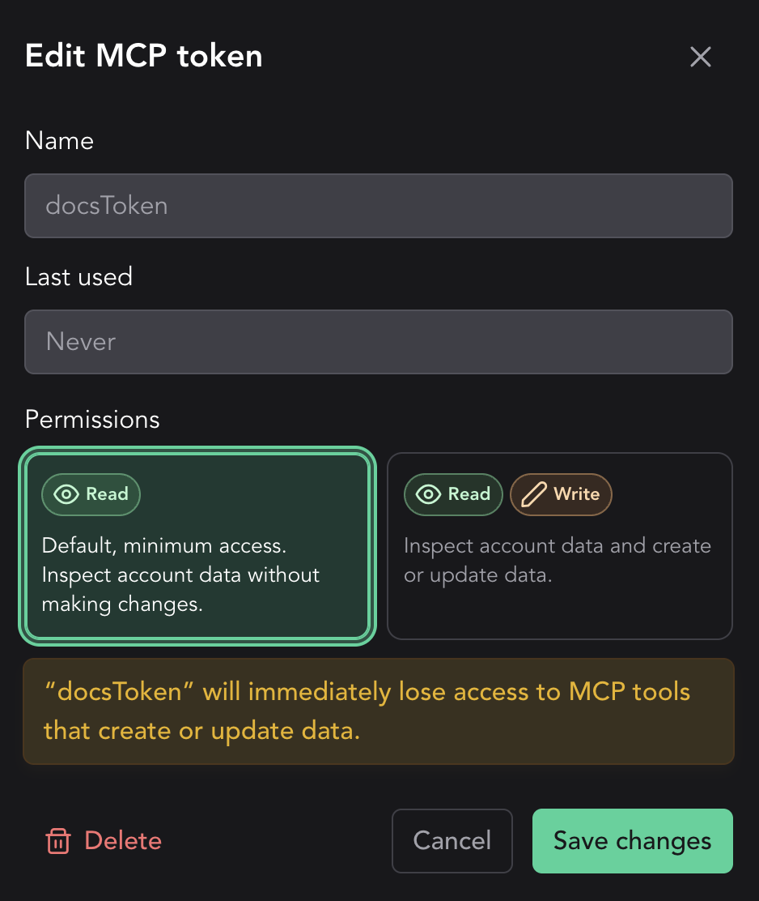

# Use Wild Edge with remote MCP

Wild Edge's remote [Model Context Protocol (MCP)](https://modelcontextprotocol.io/) server lets a local AI agent work with your Wild Edge account. You can ask the agent to create a project, inspect recent inference events, follow a trace, or investigate a failure without copying data between your browser and terminal.

The remote endpoint is:

```text
https://app.wildedge.dev/mcp
```

You do not need to install or run an MCP server locally.

## Connect your coding agent

Create a personal MCP token, then add the Wild Edge remote server to your local coding agent.

### Create an MCP token

1. Sign in to [Wild Edge](https://app.wildedge.dev/).
2. Open your profile and find **MCP access tokens**.



3. Select **Create token** and give the token a name that identifies the client, such as `Codex on MacBook`.
4. Choose the least privilege the client needs:
   - **Read** can inspect the companies, projects, events, traces, dashboards, datasets, and integrations available to your account.
   - **Read + Write** can also create projects and project keys, and invite colleagues.

   A small number of destructive tools, such as removing a company member, need an elevated delete permission that is granted by Wild Edge support rather than from your profile.



5. Create the token and copy it immediately. The full token is shown only once.

Tokens expire 90 days after they are created. Create a replacement before an expiry disconnects a client you depend on.



Store the token in an environment variable for the commands below:

```sh
export WILDEDGE_MCP_TOKEN="we_mcp_..."
```

::: warning Protect the token
An MCP token acts with your Wild Edge account's access. Do not commit it to source control or paste it into prompts. Use a separate token for each client so you can revoke one without interrupting the others. Delete a token from your profile as soon as it is no longer needed.
:::

#### Change permissions or revoke a token

Select a token in the table to change it between **Read** and **Read + Write**, or to delete it. Wild Edge shows the effect of a permission change before you save it. Deleting a token immediately disconnects clients that use it.



### Add Wild Edge MCP to your agent

Choose the client you use. The name `wildedge` in these examples is local to the client and can be changed.

#### Codex CLI

```sh
codex mcp add wildedge \
  --url https://app.wildedge.dev/mcp \
  --bearer-token-env-var WILDEDGE_MCP_TOKEN

codex mcp list
```

Codex stores the name of the environment variable, not the token itself. Make sure `WILDEDGE_MCP_TOKEN` is available whenever you start Codex.

#### Claude Code

```sh
claude mcp add-json --scope user wildedge \
  '{"type":"http","url":"https://app.wildedge.dev/mcp","headers":{"Authorization":"Bearer ${WILDEDGE_MCP_TOKEN}"}}'

claude mcp get wildedge
```

Claude Code expands `${WILDEDGE_MCP_TOKEN}` from the environment when it connects. Inside Claude Code, run `/mcp` to inspect the connection and authentication status.

#### Gemini CLI

```sh
gemini mcp add --scope user --transport http \
  --header "Authorization: Bearer ${WILDEDGE_MCP_TOKEN}" \
  wildedge https://app.wildedge.dev/mcp
```

Restart Gemini CLI, then run `/mcp list` to check the connection.

::: warning Gemini stores the expanded header
The shell expands `WILDEDGE_MCP_TOKEN` before Gemini saves this server, so the bearer token is stored in your user-level Gemini settings. Protect `~/.gemini/settings.json`, never commit it, and delete or rotate the Wild Edge token if that file is exposed.
:::

## Example workflows

After the connection works, your agent discovers the tools available to your account. You can work with Wild Edge in natural language while the MCP server enforces your user access and token permissions.

Start by establishing the account context without making changes:

> List the Wild Edge companies available to me, including my role in each company. Then list the projects in the Acme company. Do not make any changes.

Use the company and project names returned by the agent in the workflows below.

### Create a project in a company

**Requires:** an MCP token with **Read + Write** and membership in the company.

Ask the agent to create a project and return its initial `WILDEDGE_DSN`:

> Create a Wild Edge project named “Checkout classifier” in the Acme company. Show me the returned `WILDEDGE_DSN` and explain where to put it in my SDK configuration.

Review the company and project name before approving the write tool. The returned `WILDEDGE_DSN` is an SDK credential: store it in an environment variable or secret manager and do not commit it to source control.

You can also ask the agent to create an additional project key for an existing project when another environment or device fleet needs a separate DSN.

### Investigate recent inference events

**Requires:** an MCP token with **Read** access.

The agent can inspect a bounded page of recent events from the last 1 to 168 hours. A focused prompt gives it enough context to retrieve useful data:

> For the Checkout classifier project in the Acme company, inspect up to 25 events from the last 24 hours. Highlight failures and unusually long durations. Do not make any changes.

For a suspicious event, ask for its normalized telemetry and the surrounding run trace:

> Open event `<event-id>` from the previous result. Explain the inputs, outputs, errors, and timing that are available. If it belongs to a run, follow the run trace and summarize where the problem started.

The agent reasons over the bounded events returned by Wild Edge; it does not automatically analyze every event in the company. Specify the company, project, time window, and event type when you want a narrower investigation.

### Invite a colleague

**Requires:** an MCP token with **Read + Write** and company administrator access.

First, review the current team:

> List the current members of the Acme company and their roles. Do not invite or remove anyone.

Then request an invitation with an explicit role:

> Invite `alex@example.com` to the Acme company with the `VIEWER` role. Confirm the company, email address, and role with me before sending the invitation.

Supported roles are `ADMIN`, `USER`, and `VIEWER`. Inviting a colleague sends an external invitation, so review the email address and requested role before approving the tool call.

### Supported tools

The supported tools are dynamic and may change. Your agent discovers the tools available through the Wild Edge MCP server automatically. The examples below highlight some basic tools for reference and are not a complete list.

| Tool | Description |
| --- | --- |
| `get_current_user` | Get the authenticated token owner. |
| `list_companies` | List available companies and roles. |
| `invite_company_user` | Invite a colleague. |
| `get_company_usage` | Get plan, retention, and quota usage. |
| `list_apps` | List active projects. |
| `create_app` | Create a project and return its initial `WILDEDGE_DSN`. |
| `app_details` | Get project metadata. |
| `list_dashboards` | List dashboard metadata. |

Use a **Read** token for investigation-only sessions. Grant **Read + Write** only to clients that need to create projects, keys, or invitations.

## Troubleshooting

- **Unauthorized or disconnected:** confirm that `WILDEDGE_MCP_TOKEN` is set in the same shell that starts the agent, and that the token has not expired or been deleted.
- **A write action is unavailable:** edit the token in your Wild Edge profile and grant **Read + Write**, or create a separate write-enabled token. A tool that needs the elevated delete permission stays unavailable even with **Read + Write**.
- **Requests are being rejected under load:** each token is limited to 60 requests per minute. Give each client its own token rather than sharing one.
- **The agent cannot see a company or project:** MCP access follows the permissions of the Wild Edge user who created the token.
- **A token may have been compromised:** delete it immediately in **MCP access tokens**, create a replacement, and update only the affected client.
