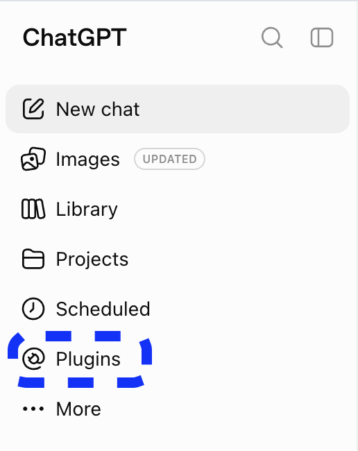
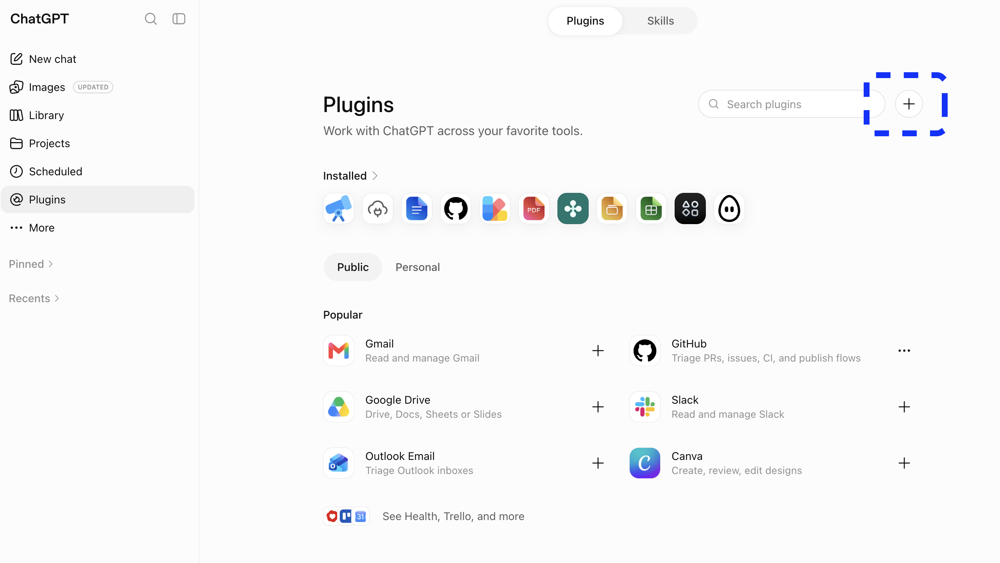
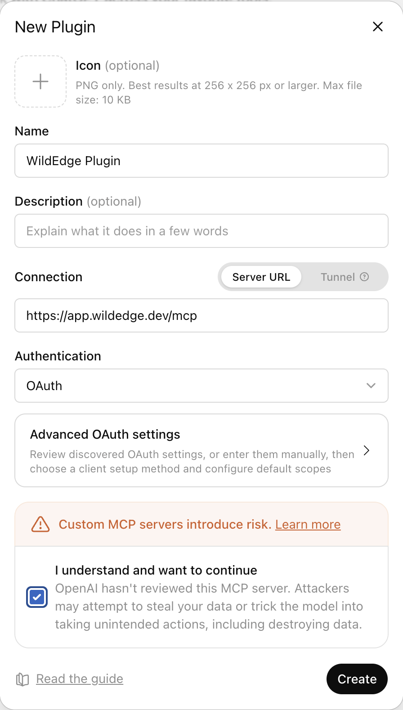
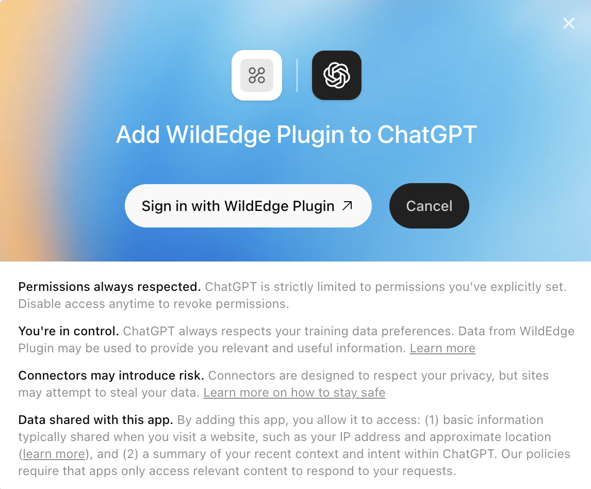
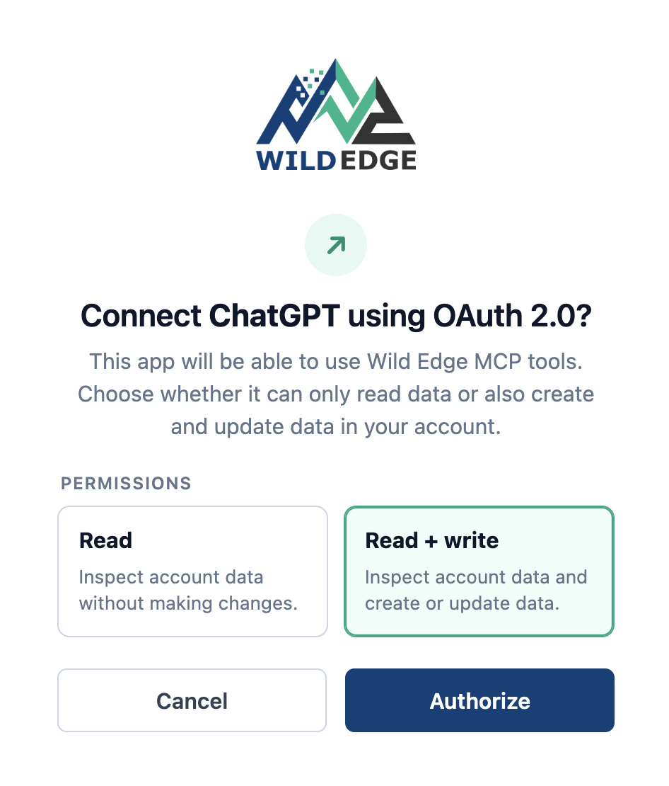
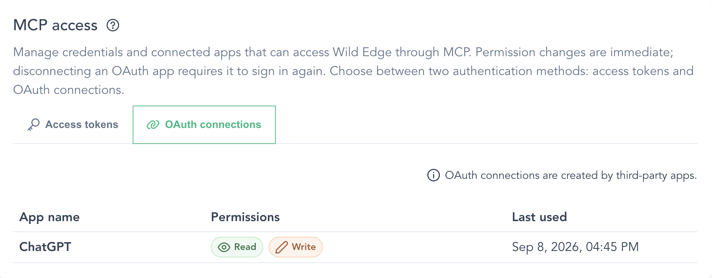

# Connect a web agent with OAuth

Wild Edge supports OAuth authentication for remote [Model Context Protocol (MCP)](https://modelcontextprotocol.io/) clients. This lets web agents such as ChatGPT and Claude connect to your Wild Edge account through a browser sign-in—there is no access token to create, copy, or paste into the agent.

Use this MCP server URL in your agent:

```text
https://app.wildedge.dev/mcp
```

During setup, the agent redirects you to Wild Edge. You sign in, choose **Read** or **Read + Write**, and authorize the connection. Wild Edge then issues and manages the OAuth credentials for that agent.

::: tip Connecting a coding agent?
For Codex CLI, Claude Code, or Gemini CLI, see the [personal access token setup guide](/mcp).
:::

## Connect ChatGPT

### 1. Open Plugins

In ChatGPT, select **Plugins** in the left sidebar.



On the Plugins page, select the **+** button.



### 2. Add the Wild Edge MCP server

Fill in the **New Plugin** form:

- **Name:** `Wild Edge` (or another name you will recognize)
- **Connection:** **Server URL**
- **Server URL:** `https://app.wildedge.dev/mcp`
- **Authentication:** **OAuth**

You can leave the icon, description, and advanced OAuth settings unchanged. Review ChatGPT's custom MCP server warning, acknowledge it if you trust this Wild Edge endpoint, and select **Create**.



::: warning Use the exact server URL
Enter `https://app.wildedge.dev/mcp`. Do not enter the documentation URL or the Wild Edge dashboard URL.
:::

### 3. Continue to Wild Edge

ChatGPT opens a connection screen. Select **Sign in with Wild Edge** to continue in your browser.



Then complete the [shared Wild Edge authorization flow](#authorize-in-wild-edge).

## Connect Claude

In Claude or Claude Desktop:

1. Open **Settings → Connectors**.
2. Select **Add custom connector**.
3. Name the connector `Wild Edge` and enter `https://app.wildedge.dev/mcp` as its remote MCP server URL.
4. Select **Add**, then **Connect** to start the OAuth flow.

For a Team or Enterprise organization, an owner may need to add Wild Edge under **Organization connectors** before individual members can connect it. See [Anthropic's custom connector guide](https://support.anthropic.com/en/articles/11175166-about-custom-integrations-using-remote-mcp) for plan and organization details.

After selecting **Connect**, complete the [shared Wild Edge authorization flow](#authorize-in-wild-edge).

## Authorize in Wild Edge

The following steps are the same whether you connect ChatGPT, Claude, or another OAuth-capable web agent.

1. If you are not already signed in to Wild Edge, sign in when prompted.
2. On the authorization screen, choose the least privilege the agent needs:
   - **Read** lets the agent inspect the companies, projects, events, traces, dashboards, datasets, and integrations available to your Wild Edge account.
   - **Read + Write** also lets the agent create or update data through the write tools exposed by Wild Edge MCP.
3. Select **Authorize**. Wild Edge returns you to the agent, which completes the connection.



Your Wild Edge password and session stay with Wild Edge. The agent receives OAuth credentials only after you approve the connection.

Start with **Read** unless you intend to ask the agent to make changes. You can change the connection's permissions later in Wild Edge.

### Try the connection

Start a chat with the Wild Edge plugin or connector available and ask a read-only question first:

> List the Wild Edge companies available to me, including my role in each company. Do not make any changes.

The agent discovers the tools exposed by Wild Edge automatically. Its access remains limited by both your Wild Edge account permissions and the permission level you approved for this OAuth connection.

## Manage or revoke access

To review a connected web agent:

1. Sign in to [Wild Edge](https://app.wildedge.dev/).
2. Open your profile and find **MCP access**.
3. Select the **OAuth connections** tab.
4. Select a connection to change it between **Read** and **Read + Write**, or choose **Disconnect** to revoke it.



Permission changes take effect immediately. Disconnecting revokes the connection and requires that agent to complete the sign-in flow again before it can use Wild Edge.

## Troubleshooting

- **The agent does not start the sign-in flow:** confirm the server URL is exactly `https://app.wildedge.dev/mcp` and authentication is set to OAuth.
- **The agent cannot see a company or project:** MCP access follows the permissions of the Wild Edge user who authorized the connection.
- **A write action is unavailable:** change the connection to **Read + Write** under **MCP access → OAuth connections**, then retry.
- **A connection is unfamiliar or no longer needed:** disconnect it immediately from the **OAuth connections** tab.
