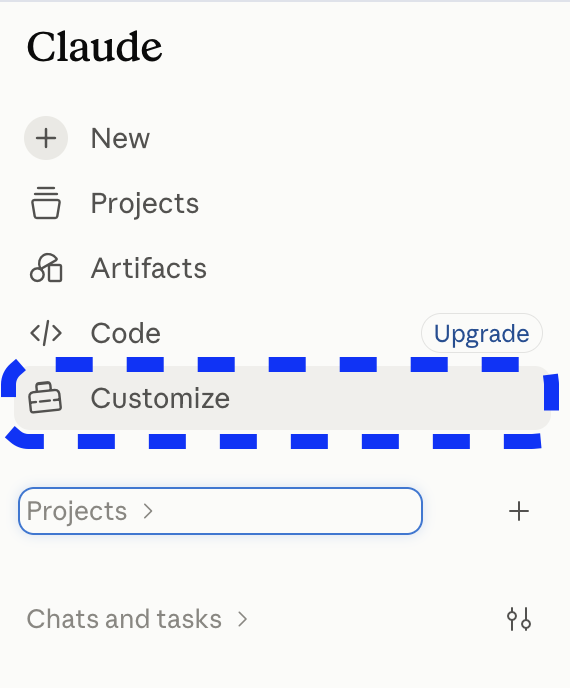
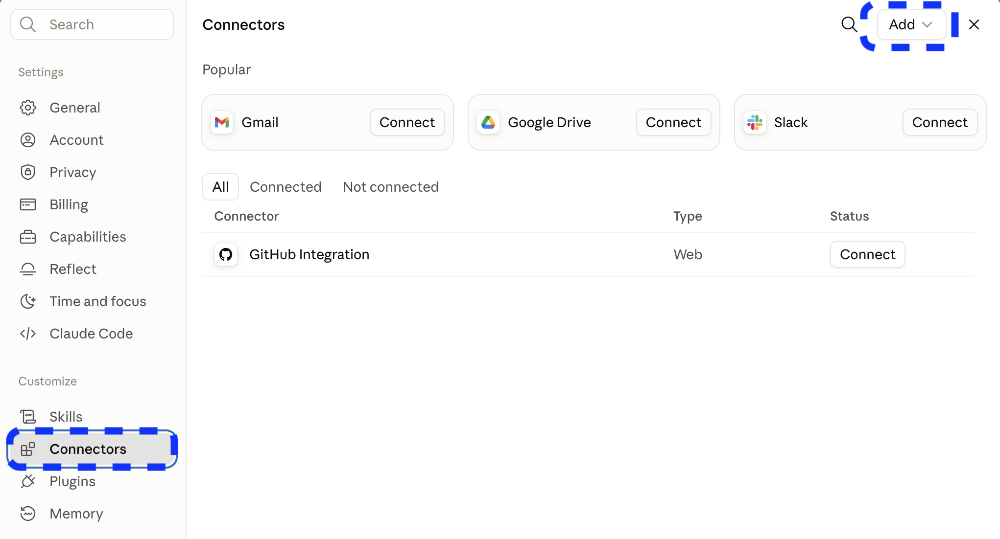
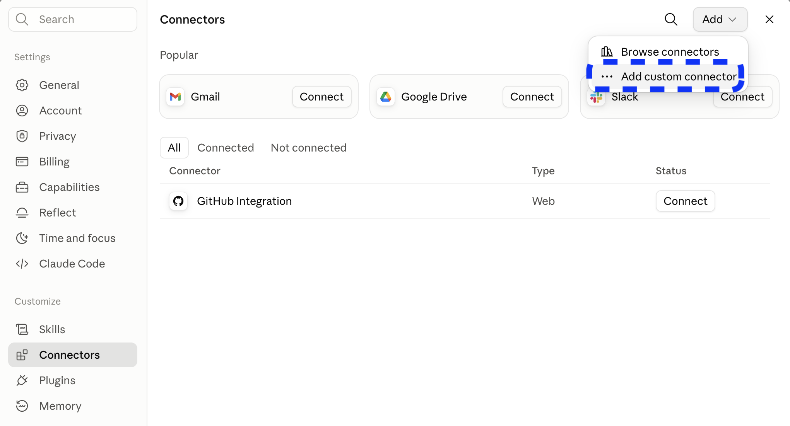
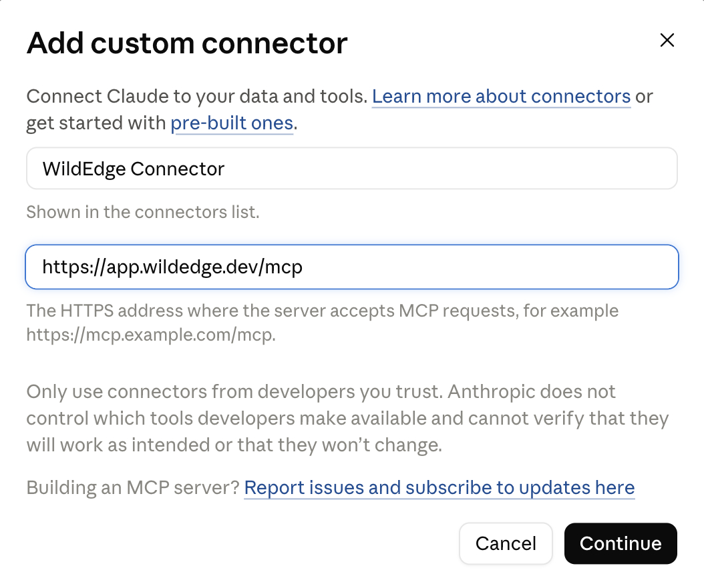
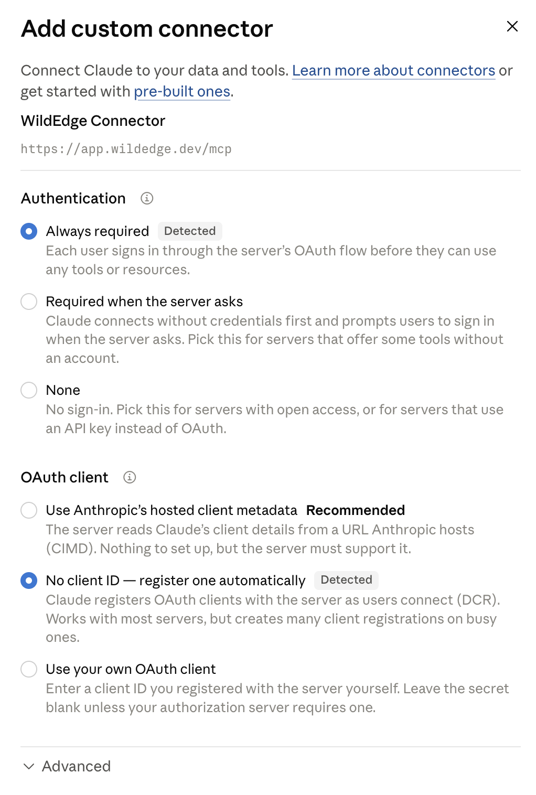
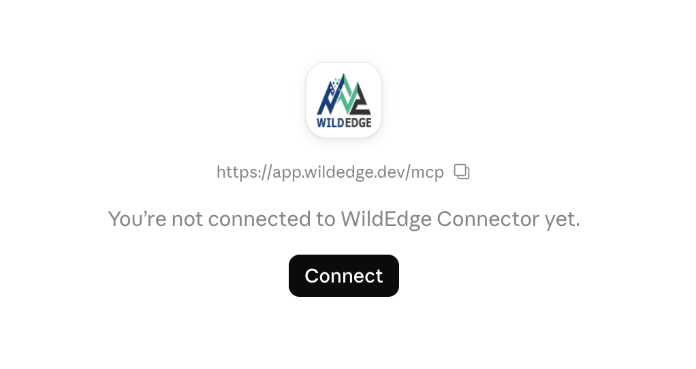
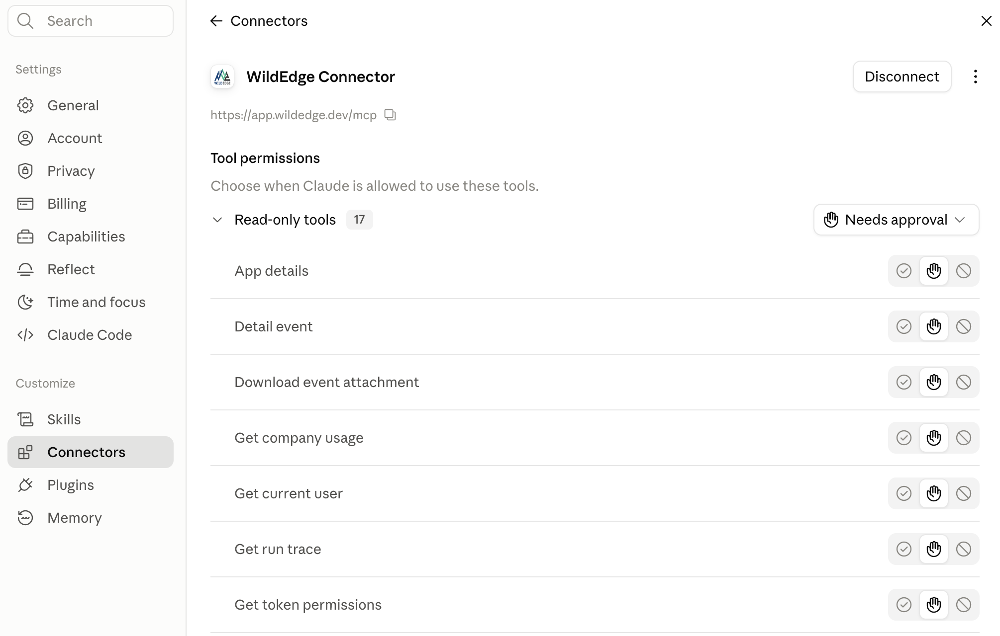

# Connect a web agent with OAuth

WildEdge supports OAuth authentication for remote [Model Context Protocol (MCP)](https://modelcontextprotocol.io/) clients. This lets web agents such as ChatGPT and Claude connect to your WildEdge account through a browser sign-in—there is no access token to create, copy, or paste into the agent.

Use this MCP server URL in your agent:

```text
https://app.wildedge.dev/mcp
```

During setup, the agent redirects you to WildEdge. You sign in, choose **Read** or **Read + Write**, and authorize the connection. WildEdge then issues and manages the OAuth credentials for that agent.

::: tip Connecting a coding agent?
For Codex CLI, Claude Code, or Gemini CLI, see the [personal access token setup guide](/mcp).
:::

## Connect ChatGPT

### 1. Open Plugins

In ChatGPT, select **Plugins** in the left sidebar.


On the Plugins page, select the **+** button.


### 2. Add the WildEdge MCP server

Fill in the **New Plugin** form:

- **Name:** `WildEdge` (or another name you will recognize)
- **Connection:** **Server URL**
- **Server URL:** `https://app.wildedge.dev/mcp`
- **Authentication:** **OAuth**

You can leave the icon, description, and advanced OAuth settings unchanged. Review ChatGPT's custom MCP server warning, acknowledge it if you trust this WildEdge endpoint, and select **Create**.


::: warning Use the exact server URL
Enter `https://app.wildedge.dev/mcp`. Do not enter the documentation URL or the WildEdge dashboard URL.
:::

### 3. Continue to WildEdge

ChatGPT opens a connection screen. Select **Sign in with WildEdge** to continue in your browser.


Then complete the [shared WildEdge authorization flow](#authorize-in-wildedge).

## Connect Claude

### 1. Open Customize

In Claude, select **Customize** in the left sidebar.



### 2. Add a custom connector

Open **Connectors**, then select **Add**.



From the menu, select **Add custom connector**.



### 3. Enter the WildEdge server URL

Name the connector `WildEdge`, enter `https://app.wildedge.dev/mcp` as the connector URL, and select **Continue**.



::: warning Use the exact server URL
Enter `https://app.wildedge.dev/mcp`. Do not enter the documentation URL or the WildEdge dashboard URL.
:::

### 4. Confirm the detected authentication settings

Claude asks follow-up questions about authentication. WildEdge supports the settings Claude detects:

- **Authentication:** **Always required**
- **OAuth client:** **No client ID — register one automatically**

Keep these detected settings, leave **Advanced** unchanged, and finish adding the connector.



### 5. Connect Claude

On the new WildEdge connector, select **Connect** to start the OAuth flow.



Then complete the [shared WildEdge authorization flow](#authorize-in-wildedge).

For a Team or Enterprise organization, an owner may need to add WildEdge under **Organization connectors** before individual members can connect it. See [Anthropic's custom connector guide](https://support.anthropic.com/en/articles/11175166-about-custom-integrations-using-remote-mcp) for plan and organization details.

## Authorize in WildEdge

The following steps are the same whether you connect ChatGPT, Claude, or another OAuth-capable web agent.

1. If you are not already signed in to WildEdge, sign in when prompted.
2. On the authorization screen, choose the least privilege the agent needs:
   - **Read** lets the agent inspect the companies, projects, events, traces, dashboards, datasets, and integrations available to your WildEdge account.
   - **Read + Write** also lets the agent create or update data through the write tools exposed by WildEdge MCP.
3. Select **Authorize**. WildEdge returns you to the agent, which completes the connection.


Your WildEdge password and session stay with WildEdge. The agent receives OAuth credentials only after you approve the connection.

Start with **Read** unless you intend to ask the agent to make changes. You can change the connection's permissions later in WildEdge.

## Finish setup in your agent

### Claude: set tool permissions

After authorizing the connection, open the WildEdge connector to control how Claude may use each MCP tool. Claude can allow a tool automatically, require your approval before using it, or disable it. You can set a default for a group and override individual tools.



Claude's tool permissions are an independent, additional control layer. They do not expand the **Read** or **Read + Write** access granted in WildEdge. A tool works only when both WildEdge and Claude allow it.

### Try the connection

Start a chat with the WildEdge plugin or connector available and ask a read-only question first:

> List the WildEdge companies available to me, including my role in each company. Do not make any changes.

The agent discovers the tools exposed by WildEdge automatically. Its access remains limited by both your WildEdge account permissions and the permission level you approved for this OAuth connection.

## Manage or revoke access

To review a connected web agent:

1. Sign in to [WildEdge](https://app.wildedge.dev/).
2. Open your profile and find **MCP access**.
3. Select the **OAuth connections** tab.
4. Select a connection to change it between **Read** and **Read + Write**, or choose **Disconnect** to revoke it.


Permission changes take effect immediately. Disconnecting revokes the connection and requires that agent to complete the sign-in flow again before it can use WildEdge.

## Troubleshooting

- **The agent does not start the sign-in flow:** confirm the server URL is exactly `https://app.wildedge.dev/mcp` and authentication is set to OAuth.
- **The agent cannot see a company or project:** MCP access follows the permissions of the WildEdge user who authorized the connection.
- **A write action is unavailable:** change the connection to **Read + Write** under **MCP access → OAuth connections**, then retry.
- **A connection is unfamiliar or no longer needed:** disconnect it immediately from the **OAuth connections** tab.
