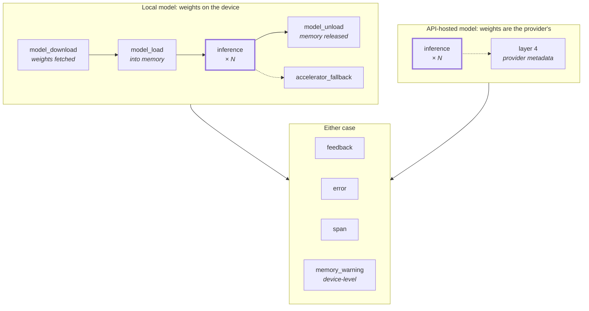

# What Wild Edge collects

Wild Edge instruments the **model lifecycle**: fetching weights, loading them, every prediction, and releasing them again, whichever side of the network the model runs on. Inference is the busiest event in that lifecycle, not the only one.

If your model runs on the device, you get the runtime layer too, because the SDK can see it: how the weights were loaded, onto which accelerator, and what the hardware was doing at the time. If your model is behind a remote API there is no load to describe, and the provider metadata layer fills in instead. Device and hardware telemetry arrives either way, because the phone still has a battery and a thermal state while it waits on a network call. Both cases produce the same event, so a request that runs locally today and falls back to an API tomorrow stays comparable in the same chart.

The SDK does not read your prompts, completions, images, or audio. It measures them and sends the measurements.

## The five layers

```mermaid
flowchart TB
    subgraph device["On the device"]
        direction TB
        raw["Raw input and output<br/><i>prompt, image, audio, completion</i>"]
        sdk["Wild Edge SDK<br/><i>measures, never copies</i>"]
        raw -->|"stays here"| sdk
    end

    subgraph wire["Sent to Wild Edge"]
        direction TB
        L1["1. Device and hardware<br/><i>thermal, battery, memory, accelerator</i>"]
        L2["2. Model artifact<br/><i>format, quantization, version</i>"]
        L3["3. Inference<br/><i>latency, tokens, confidence</i>"]
        L4["4. Provider metadata<br/><i>API-hosted models only</i>"]
        L5["5. Trace and agent<br/><i>spans, runs, conversations</i>"]
    end

    sdk -->|"batched, gzipped"| wire

    L2 -.->|"local model"| L1
    L2 -.->|"API model"| L4

    style raw stroke-dasharray: 4 4
```

Layers 1 and 2 describe *where and what* ran. Layer 3 describes *how it went*. Layer 4 appears only for API-hosted models. Layer 5 links calls together when one user action spans several of them.

The dashed box is the point of the design: raw input and output are measured on the device and the measurements are what travel. The one exception is `attachments`, which you upload deliberately and which is covered below.

## When events fire

The five layers describe what is *inside* an event. This is *when* events happen, and which of them exist at all, which depends on whether the weights are on the device or behind someone else's API.

**Only `inference` fires in both cases.** That is the point of the design: the same event shape whichever side of the network the model runs on, so a call that runs locally today and falls back to an API tomorrow stays comparable in one chart. Everything else is conditional.

| Event | Local model | API-hosted | When it fires |
| --- | :---: | :---: | --- |
| `inference` | yes | yes | Every prediction |
| `model_download` | yes | no | Weights fetched from a remote source |
| `model_load` | yes | no | Weights loaded into memory or an accelerator |
| `model_unload` | yes | no | Weights released |
| `accelerator_fallback` | yes | no | The runtime silently downgrades the accelerator |
| `feedback` | yes | yes | A user reacts to an output |
| `error` | yes | yes | A failure outside the normal event flow |
| `span` | yes | yes | Non-inference agent work |
| `memory_warning` | yes | yes | The OS reports memory pressure. Device-level, so it fires whatever your models are. |
| `context_truncation` | yes | see note | An LLM runtime drops input to fit the context window |

The four weight-handling events have nothing to describe when the weights are not yours: there is nothing to download, load, unload, or place on an accelerator. In exchange, an API-hosted inference carries [layer 4](#layer-4-provider-metadata), which a local one leaves empty.

::: tip `context_truncation` and hosted models
This event is only available where the SDK can see the input being prepared for the model. A provider that truncates server-side does so invisibly, so no event is emitted for a hosted model.
:::

Every event also carries `event_id`, `timestamp`, and the `model_id` that points into the batch model registry. Device-level events such as `memory_warning` leave `model_id` null.

Attachments are the one thing that leaves the device without being an event. They are a field on the inference event, an `attachments` array naming files that upload separately, and they are off unless you enable them. [How it gets here](#how-it-gets-here) covers that path.

## What Wild Edge never collects

By default, none of the following leaves the device:

- Prompts or completions
- Images, video, audio, or any raw input tensor
- Embedding vectors, only their `dimensions`
- Full stack traces. `error` events send `stack_trace_hash`, which groups identical failures without carrying your source.
- End-user identity. There is no advertising identifier, no email, no cookie, and no device fingerprinting.
- The raw device identifier. `device_id` is HMAC-hashed with your project secret before it is sent, so what arrives is opaque and project-scoped. Edge and embedded deployments can opt in to a stable hardware identifier instead of the generated UUID, and even then only the hash is transmitted.
- Precise location. Geography is derived server-side and resolves no finer than region.

### The three ways content can reach us

Three fields can carry content, and only these three. All are off unless you turn them on.

1. **`attributes`** on any event: a flat map of scalar values you attach yourself. Nested objects are rejected. You control every key.
2. **`input_summary` and `output_summary`** on `span` events: truncated content previews, capped by the server. Populate them only when you accept that the content is stored.
3. **`attachments`**: raw inputs or outputs, uploaded deliberately through the presign endpoint. This is the only path that carries your content verbatim, so it is gated twice: it needs a paid plan and per-project enablement, and without both the upload is refused. See [How it gets here](#how-it-gets-here).

::: warning You own what goes into these fields
The SDK cannot tell whether a value you put in `attributes` or `input_summary` is personal data. If your compliance posture depends on raw content never being stored, leave all three unused. Every field documented on the rest of this page still works without them.
:::

## Layer 1: Device and hardware

Sent once per batch as device metadata, plus a per-inference snapshot when hardware context is enabled.

| Field | Type | Notes |
| --- | --- | --- |
| `device_id` | string | A random UUID the SDK generates on first init and stores locally. Never a raw hardware identifier on the wire: it is sent as `HMAC-SHA-256(project_secret, device_id)`, so the value is opaque outside your project and cannot be correlated across projects. Call `reset_device_id()` to issue a fresh one. |
| `device_type` | string | `android`, `ios`, `linux`, `windows`, `macos`, `embedded` |
| `device_model`, `os_version` | string | Device class and OS build |
| `app_version`, `sdk_version` | string | Your build and the SDK build |
| `cpu_arch`, `cpu_cores`, `ram_total_bytes`, `disk_total_bytes` | mixed | Static device capability |
| `accelerators`, `gpu_name` | string | Accelerators the device advertises |
| `thermal_state`, `cpu_temp_celsius` | mixed | Thermal pressure at inference time |
| `battery_level`, `battery_charging` | double, bool | Power state at inference time |
| `memory_available_bytes` | long | Free memory at inference time |
| `cpu_freq_mhz`, `cpu_freq_max_mhz` | long | Current against maximum clock, which is how you see throttling |
| `accelerator_actual` | string | The accelerator the runtime **actually** used |
| `geo_country`, `geo_region` | string | Derived server-side from the request. Country and region only, never a precise location. |

`accelerator_actual` against the requested accelerator is what surfaces a silent fallback, where you asked for the NPU and the runtime quietly used the CPU. Paired with `thermal_state` and `cpu_freq_mhz`, it separates a genuinely slower model from a device that was too hot to run it properly.

## Layer 2: Model artifact

Sent once per batch as a registry, then referenced by `model_id` on each event. Every model gets an entry, including API-hosted ones, which carry `model_format: api` and a `model_source` such as `openai`, `anthropic`, `google`, or `openrouter`.

| Field | Type | Notes |
| --- | --- | --- |
| `model_name`, `model_family`, `model_version` | string | Your naming |
| `model_source` | string | `huggingface`, `local`, `coreml`, `openai`, `anthropic`, `api`, and similar |
| `model_format` | string | `onnx`, `tflite`, `coreml`, `gguf`, `pytorch`, `safetensors`, `api` |
| `quantization` | string | `f32`, `f16`, `int8`, `q4_k_m`, `q8_0`, `none` |

The registry describes the artifact. How it was *loaded*, meaning accelerator, threads, context length, and adapters, belongs to the `model_load` event under [Lifecycle events](#lifecycle-events).

This layer only exists when the weights are yours. It is what makes an on-device regression attributable to a quantization change rather than to a bad prompt.

## Layer 3: Inference

The core event. Every inference reports latency and outcome; the rest depends on modality.

### Always present

| Field | Type | Notes |
| --- | --- | --- |
| `duration_ms` | long | Wall-clock latency |
| `success`, `error_code` | bool, string | Outcome |
| `input_modality` | string | `image`, `audio`, `text`, `multimodal`, `structured` |
| `output_modality` | string | `text`, `classification`, `detection`, `segmentation`, `embedding`, `audio`, `landmarks` |

### Generative output

| Field | Type | Notes |
| --- | --- | --- |
| `tokens_in`, `tokens_out` | long | Counts, not content |
| `cached_input_tokens`, `reasoning_tokens_out` | long | Where the provider or runtime reports them |
| `time_to_first_token_ms` | long | Perceived responsiveness |
| `tokens_per_second` | double | Throughput |
| `stop_reason`, `context_used` | mixed | Why generation ended, how much window was used |
| `avg_token_entropy` | double | Output uncertainty |
| `safety_triggered` | bool | Whether your guardrail fired |

### Classification, detection, and segmentation output

| Field | Type | Notes |
| --- | --- | --- |
| `num_predictions`, `top_k` | mixed | Labels with confidences, and bounding boxes where relevant |
| `avg_confidence`, `top_confidence`, `top_label` | mixed | Prediction quality |
| `dimensions` | int | Embedding width |
| `mask_width`, `mask_height`, `num_classes` | int | Segmentation shape |

### Input measurements, for drift

This is the part worth reading closely, because it is where a monitoring tool would normally take your data. Wild Edge computes statistics on the device and sends only those.

| Modality | What is measured | What is never sent |
| --- | --- | --- |
| Image | `width`, `height`, `channels`, `format`, and a histogram summary: `brightness_mean`, `brightness_stddev`, `brightness_buckets`, `contrast`, `saturation_mean`, `blur_score`, `noise_score` | The image |
| Audio | `duration_ms`, `sample_rate`, `bit_depth`, `codec`, `snr_db`, `volume_db`, `speech_ratio`, `clipping_detected` | The audio |
| Text | `char_count`, `word_count`, `token_count`, `language`, `language_confidence`, `encoding`, `contains_code`, `prompt_type`, `turn_index` | The text |

A brightness histogram shifting over a week tells you your users moved from daylight to indoor lighting, and you learn that without a single photo leaving the device.

**Generation settings**, when you send them: `temperature`, `top_p`, `top_k`, `max_tokens`, `repetition_penalty`, `frequency_penalty`, `presence_penalty`, `seed`, `stop_sequences_count`.

## Layer 4: Provider metadata

Populated only for API-hosted models, from what the provider returns.

| Field | Type | Notes |
| --- | --- | --- |
| `resolved_model_id` | string | The checkpoint actually served, which can differ from the alias you requested |
| `system_fingerprint` | string | Opaque backend version. It changes when a provider silently updates a model. |
| `service_tier` | string | The request tier the provider applied |

If your latency doubles on a Tuesday and `system_fingerprint` changed that morning, that is your answer.

## Layer 5: Trace and agent

Optional correlation identifiers that turn isolated calls into a readable run.

| Field | Type | Notes |
| --- | --- | --- |
| `trace_id`, `span_id`, `parent_span_id` | string | Standard span hierarchy |
| `run_id`, `agent_id`, `step_index` | mixed | Agent execution position |
| `conversation_id` | string | Groups turns |

`span` events cover the non-inference work in a run, with `kind` set to `agent_step`, `tool`, `retrieval`, `memory`, `router`, `guardrail`, `cache`, `eval`, or `custom`, plus `name`, `duration_ms`, and `status`.

Spans also carry the optional `input_summary` and `output_summary`, the only fields on this page that store content previews. They are empty unless you populate them: see [the three ways content can reach us](#the-three-ways-content-can-reach-us).

## Lifecycle events

These surround inference. None of them touch your inputs or outputs.

### `model_download`

| Field | Notes |
| --- | --- |
| `source_url`, `source_type` | Where the weights came from: `huggingface`, `s3`, `gcs`, `azure`, `cdn`, `local_server` |
| `file_size_bytes`, `downloaded_bytes`, `duration_ms`, `bandwidth_bps` | Transfer size and speed |
| `network_type`, `network_generation` | `wifi`, `cellular`, `ethernet`, and the detail below it |
| `resumed`, `resume_offset_bytes`, `retry_count` | How much of the transfer was second-guessed |
| `cache_hit` | The weights were already local, and no download happened |
| `checksum_verified`, `checksum_algorithm` | Integrity check outcome |
| `decompression_time_ms`, `storage_type`, `storage_available_bytes` | Unpacking cost and where it landed |
| `http_status`, `cdn_edge` | Response code and the edge that served it |
| `success`, `error_code` | `NETWORK_TIMEOUT`, `DISK_FULL`, `CHECKSUM_MISMATCH`, `HTTP_ERROR`, `CANCELLED` |

`storage_available_bytes` alongside `DISK_FULL` is how a download failure on a class of cheap devices becomes visible before your support queue finds it.

### `model_load`

| Field | Notes |
| --- | --- |
| `duration_ms`, `compile_time_ms` | Load time, and JIT or graph compilation within it |
| `memory_bytes`, `peak_memory_bytes`, `memory_mapped` | Footprint after load, the spike during it, and whether mmap was used |
| `accelerator` | Requested target: `cpu`, `gpu`, `npu`, `tpu`, `ane`, `mps`, `vulkan` |
| `gpu_layers`, `threads` | Partial offload and CPU thread count |
| `context_length`, `kv_cache_bytes`, `kv_cache_quantization`, `flash_attention`, `rope_scaling` | LLM runtime configuration |
| `cold_start` | First load against a warm one |
| `adapter` | LoRA and similar: `adapter_id`, `adapter_type`, `adapter_source`, `size_bytes`, `rank`, `load_duration_ms` |
| `success`, `error_code` | Outcome |

`accelerator` here is what you *asked for*. `accelerator_actual` on the inference event is what you *got*, and the gap between them is a silent fallback.

### `model_unload`

| Field | Notes |
| --- | --- |
| `duration_ms` | Time to release |
| `reason` | `explicit`, `memory_pressure`, `app_background`, `session_end`, `thermal` |
| `memory_freed_bytes`, `peak_memory_bytes` | What came back, and the high-water mark while loaded |
| `uptime_ms` | How long the model stayed resident |

A population of unloads with `reason: memory_pressure` means the device chose to evict your model, which is a sizing problem rather than a bug.

## Signal events

These fire when something goes wrong or a user reacts. Each links back to the inference it concerns.

### `feedback`

| Field | Notes |
| --- | --- |
| `related_inference_id` | The inference being reacted to |
| `feedback_type` | `accept`, `reject`, `undo`, `edit`, `thumbs_up`, `thumbs_down`, `report` |
| `delay_ms` | How long the user took to react |
| `edit_distance` | For `edit`, the magnitude of the change, never the edit itself |

`undo` is the interesting one: the user accepted, then thought better of it. That is a quality signal a thumbs-down never captures.

### `error`

| Field | Notes |
| --- | --- |
| `error_code` | `OOM`, `CORRUPTED_MODEL`, `INFERENCE_TIMEOUT`, `UNSUPPORTED_OP`, `THERMAL_SHUTDOWN`, `UNKNOWN` |
| `error_message` | Optional. Free text your code supplies, passed through as written. |
| `stack_trace_hash` | A hash that groups identical failures without carrying your source |
| `related_event_id` | The inference that failed |

### `accelerator_fallback`

Fires when the runtime silently downgrades from the accelerator you requested. Without it, a GPU-to-CPU fallback is indistinguishable from a model regression.

| Field | Notes |
| --- | --- |
| `requested`, `actual` | What you asked for against what ran |
| `reason` | `thermal`, `driver_error`, `oom`, `unsupported_op`, `permission_denied`, `unknown` |
| `error_detail` | Runtime error string |
| `inference_id` | The affected inference |

Not every runtime reports a fallback it has made. Where the runtime exposes one, the SDK records it; where it does not, the SDK omits the event rather than inferring one, so the absence of this event is not proof that no fallback happened.

### `memory_warning`

The OS reporting memory pressure, independent of any inference. `model_id` is null.

| Field | Notes |
| --- | --- |
| `level` | `low`, `critical`, `kill_imminent`, normalized across platforms |
| `memory_available_bytes` | Free system memory at the warning |
| `active_model_ids` | Which models were resident and competing |
| `triggered_unload`, `unloaded_model_id` | Whether the SDK evicted something, and what |

### `context_truncation`

Fires when an LLM runtime drops input to fit the context window. Most runtimes do this silently, so quality degrades with no signal in the inference event.

| Field | Notes |
| --- | --- |
| `inference_id` | The affected inference |
| `tokens_requested`, `tokens_available`, `tokens_dropped` | Counts only, never the dropped text |
| `strategy` | `sliding_window`, `oldest_first`, `summarize`, `hard_cut`, `unknown` |
| `turn_index` | The conversation turn at which it happened |

A high `turn_index` at truncation is a capacity-planning signal rather than a model quality issue. Your context window is smaller than a typical session.

## How it gets here

Events are buffered on the device, batched, and sent to the ingest endpoint over TLS. A batch carries the device block, the model registry, and the events, so repeated metadata is sent once rather than per event. Each batch is stamped with `protocol_version`, `batch_id`, and `batch_sent_at`, and the server records `ingested_at` on arrival.

Attachments do not travel this path. They require a paid plan and must be enabled per project, and if either is missing the upload is refused before any bytes move. Bytes go straight to object storage through a presigned URL, and the event itself carries only an `attachments` array of `attachment_id`, `role`, and `content_type`.

Quota is checked per project per day, again before any bytes move, and a project over quota simply skips the upload. In every one of these cases the SDK logs a warning and sends the inference event without the attachment, because telemetry is never blocked by an attachment failure.

Every field on this page is queryable once it lands, through the dashboard, the API, and the [remote MCP server](/mcp).

## Versioning

This page documents **protocol version 1.0**. Fields are added over time and existing ones are not renamed or repurposed within a major version, so an SDK on 1.0 stays compatible. Changes are recorded in the [changelog](/changelog).
